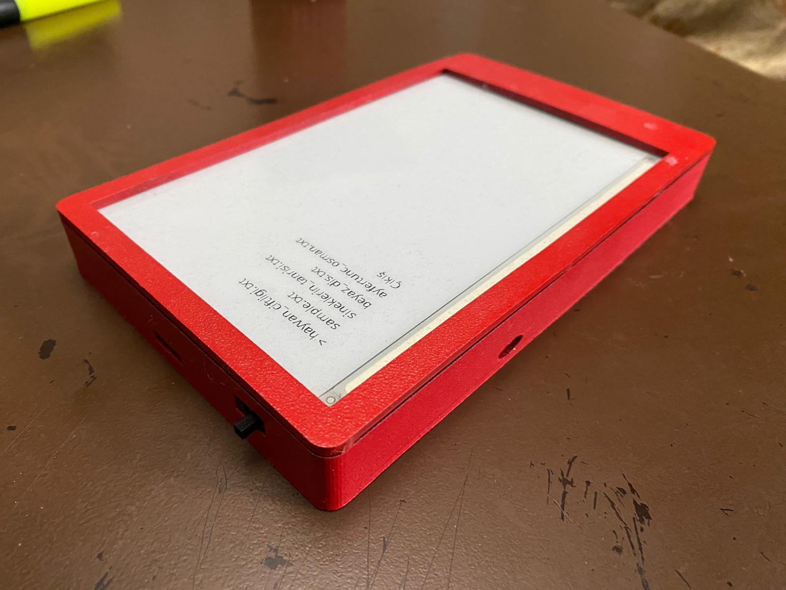

# Raspberry Pi E-Book Reader

A simple e-book reader built using a Raspberry Pi Zero 2 W and a 7.5" E-Ink
display.

This project focuses on **hardware and system integration**, not complex
application development.

# Raspberry Pi E-Book Reader

  
  

A portable Raspberry Pi Zero 2 W based e-book reader featuring a 7.5" E-Ink
display, capacitive touch buttons, and a custom 3D-printed enclosure.

---

## Hardware
- Raspberry Pi Zero 2 W  
- 7.5" Waveshare E-Ink display  
- Capacitive touch buttons  
- Rechargeable battery  

---

## What It Does
- Displays text on a 7.5" E-Ink display  
- Converts PDF files to TXT format  
- Shows current page number and total pages  
- Simple main menu for file selection  
- Capacitive buttons for:
  - Page forward
  - Page backward
  - Menu
- Automatically copies PDF files from a USB flash drive  
- Saves last read page for each file  
- Low power operation (E-Ink sleep mode)

---

## Software
- Python script for displaying text and handling buttons  
- Bash script for USB file handling  

Code files are located in the `software/` directory.

---

## Enclosure Design
- Custom enclosure designed specifically for the project using SolidWorks  
- Enclosure manufactured using PLA with 3D printing  
- Designed to fit the E-Ink display, Raspberry Pi, buttons, and battery securely  
- Focused on compact size and portable use

---

## Notes
This repository documents the working logic and system setup of the project.
The goal is to demonstrate embedded system integration rather than polished
application software.
